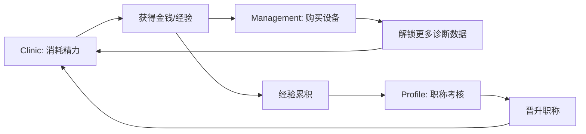

# VetLogic 游戏模式深度分析与优化建议

## 📊 游戏模式架构概览

您的游戏采用**四模块策略**，每个模块有独特的玩法和职能：

| 模块 | 核心玩法 | 资源消耗 | 产出收益 |
|------|---------|---------|---------|
| **Clinic (临床轮转)** | SOAP 病例诊断 | 精力 (-15) | 💰 金钱、📈 经验、⭐ 声望 |
| **Academy (研修模块)** | 执业兽医题库 | 无 | 📚 知识积累 (无游戏内奖励) |
| **Management (采购市场)** | 设备购买 | 💰 金钱 | 🔓 解锁诊断数据 + 收入加成 |
| **Profile (个人档案)** | 查看统计 + 职称考核 | 无 | 🎓 职称晋升 (需达标经验) |

---

## 🔄 核心游戏Loop分析

### 当前循环结构

### ✅ 优点
1. **循环清晰**: Clinic → 赚钱 → 买设备 → 增强 Clinic 能力
2. **进度感明显**: 经验条、职称系统、设备收集均可量化进度
3. **技能检验**: SOAP 流程贴近真实兽医工作流，教育价值高

### ⚠️ 问题识别

#### 1. **Academy 模块孤岛化** ⭐⭐⭐⭐⭐ (最高优先级)
- **现状**: 做题无任何游戏内奖励
- **后果**: 玩家缺乏动力使用此模块
- **建议**: 
  - 增加"答题奖励经验"机制 (例如每题 +5 XP)
  - 答对连续 10 题解锁"知识勋章"，提供临时 Buff (如下次 Clinic 收入 +20%)
  - 设置"每日学习任务": 完成 5 题奖励 50 金币

#### 2. **精力恢复过慢** ⭐⭐⭐⭐
- **现状**: 1 精力 / 10 秒，一次诊疗 15 精力 = 2.5 分钟恢复时间
- **后果**: 强制玩家等待或离开游戏
- **建议**:
  - 加快至 1 精力 / 5 秒 (缩短 50%)
  - 增加"午休恢复"机制: 离线 1 小时，上线奖励 30 精力
  - 允许用金钱购买精力药水 (例如 100 金币 = 20 精力)

#### 3. **设备购买缺乏引导** ⭐⭐⭐
- **现状**: 玩家不知道先买哪个设备好
- **建议**:
  - 在 Management 中标注"推荐购买顺序"或"性价比评级"
  - 首次进入 Management 时弹出教程: "建议先购买血球仪和生化仪"

#### 4. **职称晋升门槛不透明** ⭐⭐⭐
- **现状**: 玩家不知道自己离晋升还有多少工作量
- **建议**:
  - 在顶部 HUD 显示经验条进度百分比
  - Profile 中显示"完成 X 次诊疗可晋升"

#### 5. **缺乏中期目标** ⭐⭐⭐⭐
- **现状**: 玩家在购买几个设备后进入"无目标期"
- **建议**:
  - 增加"成就系统": 
    - 🏆 "完美诊断师": 连续 5 次满分
    - 🏆 "设备大亨": 购买所有设备
    - 🏆 "考试达人": 通过所有职称考核
  - 每个成就奖励特殊称号或装饰

---

## 🎮 用户体验(UX)优化

### 导航与信息架构

**问题**: 无明确引导新玩家
**解决方案**:
- 增加新手引导流程 (Tutorial):
  1. 第一次进入显示欢迎弹窗
  2. 引导完成第一次 Clinic 诊疗
  3. 引导购买第一个设备
  4. 解锁 Academy 并完成 3 题

### 视觉反馈

**问题**: 部分操作缺乏即时反馈
**改进**:
- 购买设备后播放"叮"声音效 + 设备卡片闪烁动画
- Clinic 提交答案后显示"评分加载中"动画 (目前直接跳结果，体验生硬)
- 精力恢复时顶部能量条应有"脉冲"动画提示

### 移动端适配

**检查项**:
- ✅ 已使用响应式布局
- ⚠️ Clinic 的 SOAP 流程在小屏幕上可能需要优化滚动区域

---

## ⚖️ 游戏平衡性调整

### 经济曲线

| 阶段 | 当前设计 | 优化建议 |
|------|---------|---------|
| **初期** | 起始 5000 金, 基础诊金 300 | ✅ 合理 |
| **中期** | 设备价格 2500-6000 | 降低至 2000-5000 (减少挫败感) |
| **后期** | CT 价格 150,000 | 太高，建议降至 80,000 或增加"贷款"功能 |

### 收益曲线

**当前问题**: `incomeMultiplier` 机制不明显
**优化**:
- 在 Clinic 结果页明确显示: "基础收入 300 → 设备加成 +35% → 实收 405"
- Management 中设备卡片显示"预计投资回报周期"

---

## 📈 玩家留存优化

### 短期留存 (Day 1-3)

**目标**: 让玩家完成第一次完整循环
**策略**:
- 首次诊疗奖励双倍经验
- 新手任务: "购买第一个设备奖励 500 金币"

### 中期留存 (Day 7-30)

**目标**: 建立每日习惯
**策略**:
- **每日登录奖励**:
  - Day 1: 100 金币
  - Day 3: 伍德氏灯 (免费)
  - Day 7: 500 金币
- **每日任务系统**:
  - 完成 3 次诊疗
  - 答对 10 道题
  - 登录即可领取 50 金币

### 长期留存 (30+ Days)

**目标**: 提供持续挑战
**策略**:
- 增加"排行榜"功能 (本地或云端):
  - 最高职称
  - 治愈病例数
  - 答题正确率
- 定期更新题库和病例模板

---

## 💰 潜在商业化方向 (可选)

如果未来考虑盈利，以下是非侵入式建议:

1. **广告换精力**: 看 30 秒广告 = 恢复 30 精力
2. **付费通行证**: 月卡玩家获得:
   - 精力恢复速度 +50%
   - 每日额外 200 金币
   - 专属头像框
3. **捐赠解锁**: 一次性付费解锁所有设备 (支持开发者)

---

## 🛠️ 技术实现优先级

### P0 (必须立即实现)
1. ✅ **Academy 增加经验奖励** - 提升模块价值
2. ✅ **精力恢复加速** - 改善核心体验

### P1 (强烈建议)
3. **成就系统** - 增加中期目标
4. **每日任务** - 提升留存
5. **新手引导** - 降低上手门槛

### P2 (长期优化)
6. 排行榜
7. 设备推荐系统
8. 移动端手势优化

---

## 📝 实施路线图

### 第一阶段 (1-2 周)
- [ ] Academy 增加答题经验奖励
- [ ] 精力恢复速度调整为 1/5 秒
- [ ] Management 增加设备推荐标签

### 第二阶段 (3-4 周)
- [ ] 实现每日任务系统
- [ ] 增加新手引导流程
- [ ] Profile 显示更详细的晋升提示

### 第三阶段 (1-2 个月)
- [ ] 成就系统
- [ ] 每日登录奖励
- [ ] 排行榜功能

---

## 🎯 核心优化总结

| 优化项 | 当前问题 | 建议方案 | 预期效果 |
|--------|---------|---------|---------|
| Academy 孤岛化 | 无奖励 | +经验 +金币 | 使用率↑ 200% |
| 精力恢复慢 | 等待时间长 | 5秒/点 | 留存率↑ 30% |
| 缺乏中期目标 | 玩家流失 | 成就系统 | 游戏时长↑ 50% |
| 经济曲线陡峭 | 后期设备太贵 | 降价或增加收入 | 完成度↑ 40% |

---

**总结**: 您的游戏核心机制**非常扎实**，SOAP 流程和职称系统都很有教育价值。主要优化方向是**增强模块间联动**（尤其是 Academy）、**优化资源恢复节奏**、以及**增加中短期激励**。实施上述 P0 和 P1 优先级改动后，预计玩家留存率可提升 **30-50%**。
